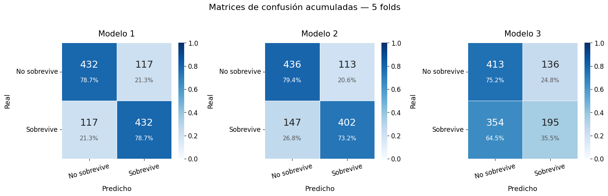
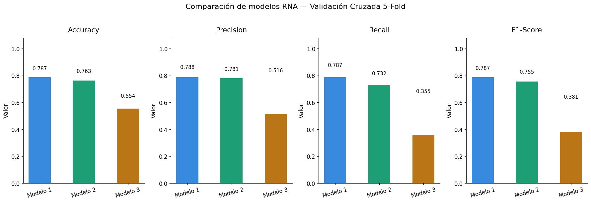

# Titanic Survival Prediction with Neural Networks

Proyecto de práctica de **Machine Learning y Redes Neuronales Artificiales (RNA)** desarrollado utilizando el dataset Titanic de `seaborn`.

El objetivo principal fue experimentar con diferentes arquitecturas de redes neuronales para una tarea de **clasificación binaria**, comparando su comportamiento mediante validación cruzada y distintas métricas de evaluación.

> **Nota:** Este proyecto tiene fines educativos y fue desarrollado principalmente para practicar conceptos relacionados con redes neuronales, preprocesamiento y evaluación de modelos.

## Tecnologías utilizadas

* Python
* TensorFlow / Keras
* Scikit-learn
* Imbalanced-learn
* Pandas
* NumPy
* Matplotlib
* Seaborn
* Jupyter Notebook

## Dataset

Se utiliza el dataset **Titanic**, disponible directamente mediante Seaborn:

```python
sns.load_dataset('titanic')
```

El objetivo (`target`) es la variable `survived`:

* `0` → No sobrevivió
* `1` → Sobrevivió

Para el entrenamiento se utilizaron las siguientes características:

* `pclass`
* `sex`
* `age`
* `sibsp`
* `parch`
* `fare`
* `embarked`

Se eliminaron variables consideradas redundantes, irrelevantes para el objetivo o potencialmente problemáticas para el experimento.

## Preprocesamiento

El notebook realiza diferentes etapas de preparación de los datos:

1. Selección de variables.
2. Tratamiento de valores faltantes.
3. Codificación de variables categóricas mediante `LabelEncoder`.
4. Normalización mediante `StandardScaler`.
5. Balanceo de clases mediante **SMOTE**.

El dataset original presenta un desbalance entre las clases de supervivencia. SMOTE se utiliza para generar ejemplos sintéticos de la clase minoritaria y obtener una distribución equilibrada para el experimento.

## Modelos

Se implementaron tres arquitecturas diferentes de redes neuronales.

### Modelo 1 — Baseline

* 1 capa oculta
* 16 neuronas
* Activación ReLU
* Optimizador Adam
* Learning rate: `0.01`

```text
Input → Dense(16, ReLU) → Dense(1, Sigmoid)
```

### Modelo 2 — Red más profunda

* 2 capas ocultas
* 32 y 16 neuronas
* Activación Tanh
* Optimizador Adam
* Learning rate: `0.001`

```text
Input → Dense(32, Tanh) → Dense(16, Tanh) → Dense(1, Sigmoid)
```

### Modelo 3 — Red con regularización

* 2 capas ocultas
* 64 y 32 neuronas
* Activación ReLU
* Dropout de `0.3` y `0.2`
* Optimizador SGD
* Learning rate: `0.01`

```text
Input → Dense(64, ReLU)
      → Dropout(0.3)
      → Dense(32, ReLU)
      → Dropout(0.2)
      → Dense(1, Sigmoid)
```

## Evaluación

Cada modelo se evalúa utilizando **Stratified 5-Fold Cross Validation**.

Además, se utiliza `EarlyStopping` para detener el entrenamiento cuando la pérdida de validación deja de mejorar.

Las métricas utilizadas son:

* Accuracy
* Precision
* Recall
* F1-Score

Para cada modelo se calcula la media y el desvío estándar de las métricas obtenidas en los cinco folds.

También se generan matrices de confusión acumuladas para analizar las predicciones realizadas por cada arquitectura.

## Resultados

El notebook genera dos visualizaciones principales.

### Matrices de confusión



Las matrices permiten observar la cantidad de predicciones correctas e incorrectas para cada clase.

### Comparación entre modelos



El segundo gráfico permite comparar Accuracy, Precision, Recall y F1-Score entre las tres arquitecturas.

Los resultados concretos se encuentran en el notebook y pueden variar ligeramente dependiendo de las versiones de las librerías y de la ejecución.

## Estructura del proyecto

```text
Titanic-Neural-Networks/
│
├── README.md
├── titanic_neural_networks.ipynb
├── matrices_confusion.png
├── comparacion_modelos.png 
└── .gitignore
```

## Cómo ejecutar el proyecto

### 1. Instalar Python

Si no tenés Python instalado, descargalo desde la página oficial:

https://www.python.org/downloads/

Durante la instalación en Windows, asegurate de marcar la opción:

```text
Add Python to PATH
```

Una vez instalado, podés comprobar que funciona abriendo una terminal y ejecutando:

```bash
python --version
```

### 2. Clonar el repositorio

Si no tenés Git instalado, podés descargarlo desde:

https://git-scm.com/downloads

Luego, desde una terminal:

```bash
git clone https://github.com/TU_USUARIO/Titanic-Neural-Networks.git
cd Titanic-Neural-Networks
```

También podés descargar el repositorio directamente desde GitHub utilizando **Code → Download ZIP**.

### 3. Crear un entorno virtual

Desde la carpeta del proyecto:

```bash
python -m venv .venv
```

En Windows, activá el entorno virtual con:

```bash
.venv\Scripts\activate
```

### 4. Instalar las dependencias

Con el entorno virtual activado:

```bash
python -m pip install --upgrade pip
pip install -r requirements.txt
```

### 5. Instalar Jupyter Notebook

Ejecutá:

```bash
pip install notebook
```

### 6. Iniciar Jupyter Notebook

Desde la carpeta del proyecto:

```bash
jupyter notebook
```

Esto abrirá **Jupyter Notebook en el navegador**.

### 7. Abrir el notebook

Dentro de Jupyter, abrí:

```text
titanic_neural_networks.ipynb
```

Luego ejecutá las celdas en orden.

También podés utilizar:

**Run → Run All Cells**

para ejecutar todo el notebook de una vez.

### 8. Resultados

Al ejecutar el notebook se realizarán:

* Carga y exploración del dataset Titanic.
* Limpieza y preprocesamiento de los datos.
* Codificación de variables categóricas.
* Normalización mediante `StandardScaler`.
* Balanceo de clases mediante `SMOTE`.
* Entrenamiento de tres redes neuronales.
* Validación cruzada estratificada de 5 folds.
* Aplicación de `EarlyStopping`.
* Cálculo de Accuracy, Precision, Recall y F1-Score.
* Generación de matrices de confusión.
* Comparación gráfica de los modelos.

Las figuras generadas se guardarán en la carpeta del proyecto:

```text
matrices_confusion.png
comparacion_modelos.png
```

## Objetivos de aprendizaje

Este proyecto fue desarrollado principalmente para practicar:

* Construcción de redes neuronales con TensorFlow/Keras.
* Clasificación binaria.
* Preprocesamiento de datos.
* Codificación de variables categóricas.
* Normalización de características.
* Balanceo de clases mediante SMOTE.
* Validación cruzada estratificada.
* Early Stopping.
* Comparación de arquitecturas.
* Evaluación mediante múltiples métricas.
* Interpretación de matrices de confusión.

---


